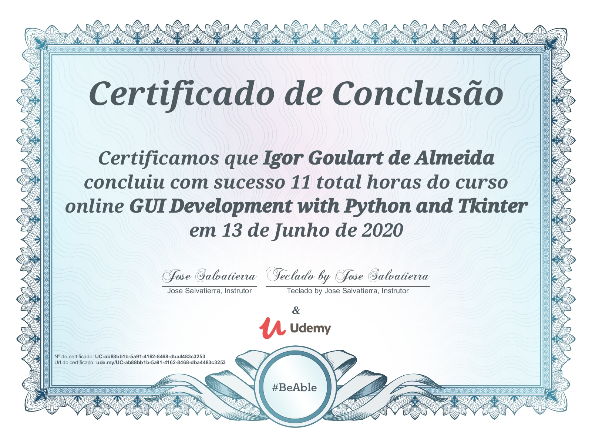

# tkinter-python-course
> My Python files created during the course: _Python GUI development using Tkinter to build desktop applications_. Total length of 11 hours.

## Discussed Topics

- Layout: grid and pack
- Tkinter frames for more complex layouts
- Shortcuts and keybindings 
- Object-Oriented Programming with Tkinter, 
- Custom widgets
- Styles using Themed Tkinter Widgets
- Fonts and named fonts
- Split Tkinter apps into multiple files
- Connect to web APIs to send and receive data, stored in the cloud
- Games using Tkinter and tCanvas widget
- Package and distribution of applications
